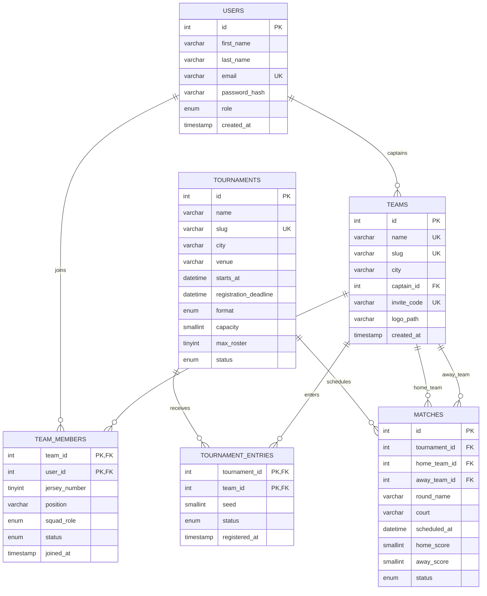

# Blacktop Takeover ER Diagram

The diagram below is rendered directly by GitHub. Primary keys, foreign keys, and associative entities match `database/blacktop_takeover.sql`.

## Relationship notes

- `team_members` resolves the many-to-many relationship between users and teams and stores roster-specific information.
- `tournament_entries` resolves the many-to-many relationship between teams and tournaments and stores approval status and seeding.
- Each match belongs to one tournament and references the competing teams twice through `home_team_id` and `away_team_id`.
- Deleting a team removes its membership and tournament-entry records through cascading foreign keys.
- Deleting a tournament removes its entries and fixtures, while completed fixtures remain protected by application rules until intentionally removed.

## Derived SQL view

`tournament_match_feed` is a derived read model rather than a separate entity. It joins `matches`, `tournaments`, and two aliases of `teams` to provide named fixtures and results to Match Centre.
